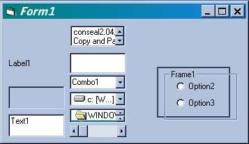

<div align="center">

## Move controls in a form


</div>

### Description

Use this code to drag and drop (almost) any control anywhere on a form.
 
### More Info
 
Add some controls and a checkBox Named chkOnOff


<span>             |<span>
---                |---
**Submitted On**   |
**By**             |[Michael Klinteberg](https://github.com/Planet-Source-Code/PSCIndex/blob/master/ByAuthor/michael-klinteberg.md)
**Level**          |Beginner
**User Rating**    |3.7 (11 globes from 3 users)
**Compatibility**  |VB 5\.0, VB 6\.0
**Category**       |[Miscellaneous](https://github.com/Planet-Source-Code/PSCIndex/blob/master/ByCategory/miscellaneous__1-1.md)
**World**          |[Visual Basic](https://github.com/Planet-Source-Code/PSCIndex/blob/master/ByWorld/visual-basic.md)
**Archive File**   |[](https://github.com/Planet-Source-Code/michael-klinteberg-move-controls-in-a-form__1-7065/archive/master.zip)

### API Declarations

Option Explicit


### Source Code

```
Private Sub chkOnOff_Click()
On Error Resume Next 'resume next beacuse not all controls support dragmode
Dim ctl As Control
'Turn dragmode on/off
 If chkOnOff.Value Then
  For Each ctl In Me.Controls
   'Debug.Print TypeName(ctl)
   ctl.DragMode = vbAutomatic
  Next
 Else
  For Each ctl In Me.Controls
   'Debug.Print TypeName(ctl)
   ctl.DragMode = vbManual
  Next
 End If
 Me.chkOnOff.DragMode = vbManual
End Sub
Private Sub Form_DragDrop(Source As Control, X As Single, Y As Single)
'Move the control
 Source.Top = Y
 Source.Left = X
End Sub
```

